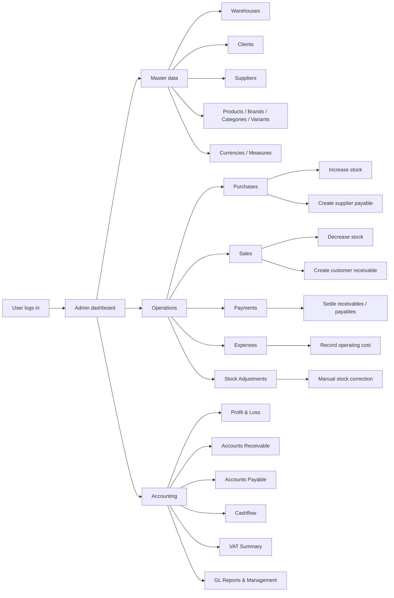
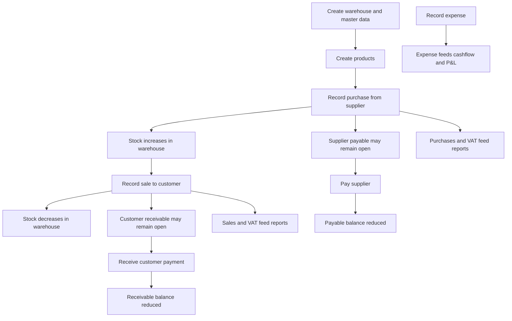
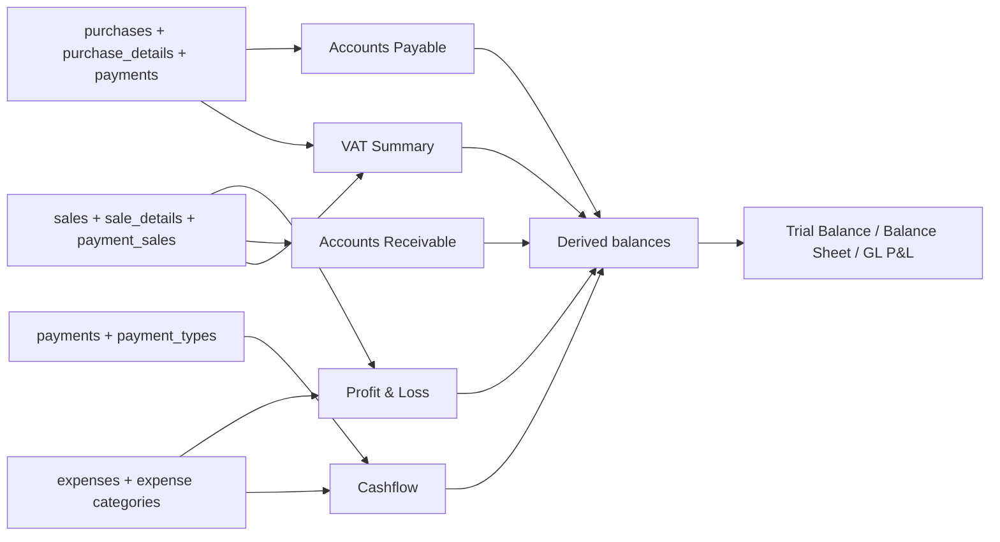
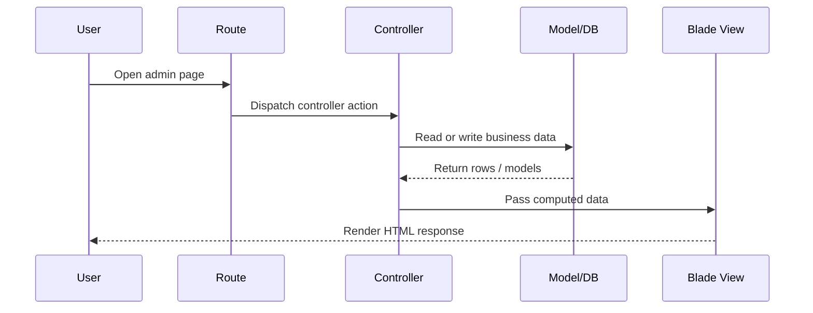

# AC Accounting

AC Accounting is a Laravel 9 inventory, sales, purchasing, payments, and accounting application. It is built for small to medium operations that need one admin panel to manage stock movement, customer and supplier transactions, operational expenses, and accounting reports.

This repository is not a blank Laravel starter anymore. It already contains:

- Operational modules for warehouses, products, purchases, sales, payments, expenses, and stock adjustments
- Reporting modules for receivables, payables, cashflow, VAT, and general-ledger style views
- Seeded demo data and a default administrator account
- SQLite support for fast local setup

## What The Project Does

At a high level, the application tracks business activity and turns it into management and accounting reports:

- Products are stored in warehouses
- Purchases increase stock and create supplier obligations
- Sales decrease stock and create customer receivables
- Payments settle sales or purchases
- Expenses record non-inventory operational costs
- Accounting reports summarize the live operational data

## Main Modules

- Authentication and admin dashboard
- Users, roles, and permissions
- Localization support
- Warehouses
- Measures and currencies
- Clients and suppliers
- Product categories, brands, products, variants, and product images
- Purchases and purchase payments
- Sales, invoices, and POS-style sale payments
- Expenses and expense categories
- Stock adjustments
- Accounting reports
- GL management screens:
  - Chart of accounts
  - Journal entries
  - Accounting mappings
  - Opening balances
  - Periods

## System Diagram



## Business Flow



## Accounting Report Flow



## Request Flow In Code

The application is a classic Laravel MVC app:

- Routes are defined in `routes/web.php`
- Controllers live in `app/Http/Controllers`
- Eloquent models live in `app/Models`
- Blade views live in `resources/views`
- Migrations and seeders live in `database/`

Typical request path:



## Important Route Groups

The route file exposes these main areas:

- `/admin`
  - dashboard
- `/admin/users`, `/admin/roles`, `/admin/permissions`
  - access management
- `/admin/warehouses`, `/admin/clients`, `/admin/suppliers`
  - master data
- `/admin/products`, `/admin/productscategories`, `/admin/productsbrands`, `/admin/variants`
  - catalog and inventory metadata
- `/admin/purchases`, `/admin/sales`
  - business transactions
- `/admin/payments`, `/admin/paymentsales`
  - payment recording
- `/admin/expenses`, `/admin/expensescategories`
  - expense management
- `/admin/adjustments`
  - manual stock corrections
- `/admin/accounting/...`
  - reporting and GL management

## Data Model Summary

Key business tables:

- `warehouses`
- `products`
- `product_warehouse`
- `clients`
- `suppliers`
- `purchases`
- `purchase_details`
- `sales`
- `sale_details`
- `payments`
- `payment_sales`
- `expenses`
- `expenses_categories`
- `adjustments`
- `adjustment_details`

Key accounting tables:

- `gl_accounts`
- `gl_journal_entries`
- `gl_journal_entry_lines`
- `gl_accounting_mappings`
- `gl_opening_balances`
- `gl_periods`

## Dashboard Summary

The admin dashboard aggregates live data and shows:

- sales today count and amount
- sales this month
- purchases this month
- expenses this month
- net month
- product, client, supplier, warehouse, and user counts
- recent sales and purchases
- seven-day chart data

## Accounting Screens Explained

### Profit & Loss

Built from:

- `sales.total_amount` for revenue
- `sale_details.total_price` for cost of goods sold
- `expenses.amount` for expenses

Calculated summary:

- Revenue
- COGS
- Gross Profit
- Expenses
- Net Profit

### Accounts Receivable

Built from sales and linked customer payments:

- each sale is compared with total paid amount
- due amount is `grand total - paid`
- status becomes `Paid`, `Partial`, or `Unpaid`
- aging buckets are split into `0-30`, `31-60`, and `60+` days

### Accounts Payable

Built from purchases and supplier payments:

- each purchase is compared with total paid amount
- due amount is `grand total - paid`
- status becomes `Paid`, `Partial`, or `Unpaid`
- aging buckets are calculated the same way as receivables

### Cashflow

Built from:

- incoming customer payments
- outgoing payments not linked to sales
- expenses grouped by category

Reported values:

- Incoming Total
- Outgoing Total
- Total Expenses
- Net Cash

### VAT Summary

Built from:

- `sales.tax_amount` as VAT collected
- `purchases.tax_amount` as VAT paid

Reported values:

- VAT Collected
- VAT Paid
- VAT Net

## Local Setup

### Requirements

- PHP 8+
- Composer
- Node.js and npm
- SQLite

### Quick Start

```bash
git clone git@github.com:white-spider-200/AC-accounting-.git
cd AC-accounting-
composer install
npm install
cp .env.example .env
php artisan key:generate
touch database/database.sqlite
php artisan migrate --seed
php artisan serve
```

In a second terminal:

```bash
npm run dev
```

Open:

- App: `http://127.0.0.1:8000`

## Seeded Login

Default local credentials after `php artisan migrate --seed`:

- Email: `admin@example.com`
- Password: `password`

The seeders also create initial demo data such as:

- warehouses
- currencies
- measures
- payment types
- payment statuses
- sale and purchase statuses
- sample client and supplier records
- one sample product

## Test Coverage

Feature tests already cover core flows such as:

- expense creation
- purchase creation and supplier payment persistence
- sale creation and customer payment persistence
- stock adjustments

Run tests with:

```bash
php artisan test
```

## Tech Stack

- Laravel 9
- Blade templates
- Vite
- Bootstrap-based admin UI
- SQLite for easy local use

## Project Structure

```text
app/
  Http/Controllers/   HTTP actions and reporting logic
  Models/             Eloquent models
database/
  migrations/         Schema changes
  seeders/            Initial and demo data
resources/
  views/              Blade UI
  js/                 Frontend entry points
  sass/               Styles
routes/
  web.php             Main web routes
tests/
  Feature/            End-to-end feature coverage
```

## Notes For Contributors

- This repository contains some legacy assets and backup-style files from the original project snapshot
- The app mixes operational reporting and GL-style reporting in one codebase
- `.env`, `vendor`, `node_modules`, and `database/database.sqlite` are intentionally ignored
- Most business screens are under the `/admin` area and require authentication

## Recommended Next Cleanup

If you want to improve maintainability after the initial import, the next practical steps are:

1. Remove backup and duplicate view files such as `*Copy.php`
2. Remove old exported CSV and log artifacts from tracked files
3. Split accounting logic into smaller services instead of one large controller
4. Add screenshots for the major modules
5. Expand tests around accounting report calculations
